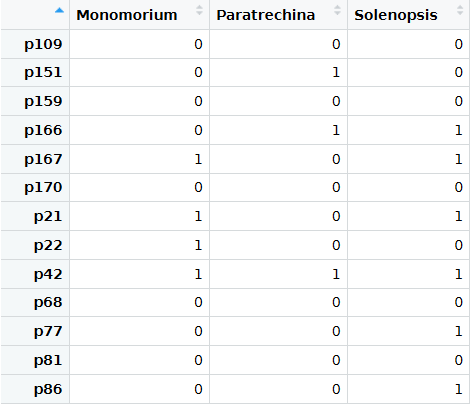

# Introducción

La urbanización implica la alteración de un ecosistema para beneficio humano, esto trae como consecuencia la perdida de especies nativas y a la disminución de la bio diversidad [@mckinney2002urbanization]. Sin embargo esto también crea heterogeneda
 en el habitat lo que beneficia, principalmente a las especies mejores adaptados a este tipo de ecosistemas. Mientras que animales vertebrados y plantas
 requieren de zonas grandes, los parches pequeños son suficientes para pequeños organismos.[@mckinney2008effects]

En la universidad Autónoma de santo domingo se pueden identificar 4 tipos diferentes de habitats edificación erguida, construido (bordes edificios, acerado, bancos, postes...) suelo, no edificado ni cubierto y dosel. 

Los artrópodos son ideales para estudiar los efectos de la urbanización gracias a su corto ciclo de vida, su facilidad de muestreo, a su importancia en la cadena trófica y sirven como bioindicadores importantes para los cambios ecológicos. [@mcintyre2000ecology]

Las hormigas son una buena opción a la hora de estudiar las de zonas urbanas gracias a su facilidad de adaptación, su abundancia y facilidad para recolección (
@holway2002causes).

Las especies invasoras son uno de los factores que afectan a las especies nativas, estos tienden a prosperar en habitats urbanos y a desplazar especies locales [@agosti2000ants].

En la República Dominicana no existen muchos articulo sobre la composición de hormigas en ambientes urbanos, por lo que este trabajo pretende el estudio de especie en zonas urbanas y como estos son afectados por el mismo.

# Metodología

Se dividió el área de la Universidad Autónoma de Santo Domingo en 189 parcelas y se seleccionaron 13 parcelas (6 próximas y 7 alejadas de sitios a comida) de 50 metros cuadrados.  Se recorrieron los transectos seleccionadas y se recolectaban muestras de hormigas de los hormigueros observados, aparte se anotaba información pertinente. Esto incluyen cercanía con caminos, tanques de basura y agua estancada, Así como las coordenadas de los nidos y el tipo de cubierta predominante de la parcela.

Para la recolección se utilizó un pincel de hebras suaves y las hormigas se almacenaban en tubos plásticos con alcohol etílico al 80%.

Se observabaron las hormigas con una lupa de mesa y la identificación de las hormigas se realizo usando la paguina Antwiki.org.

Se utilizó Rstudio para la realización de las tablas y el manuscrito.
# Resultados

Se observaron 13 nidos totales con una riqueza de 3 especies en los trancemos analizados.(figura 1)

En los trancemos próximas a sitios de comida se promediaron 1.8 especies mientras que en las parcelas alejadas a sitios de comida el promedio de especies fue de 0.3.

Las zonas de suelo no edificados ni cubiertos y edificaciones se encontraron el mismo numero de muestras con los trancemos en suelo no edificados teniendo la mayor diversidad de especies.La mayoría de nidos fueron encontrados a una distancia de 1 a 5 metros de basureros y en general no se encontraron cerca de zonas de agua. (figura 2)

Solenopsis tenia preferencia de suelos herbaceos no cubiertos ni construidos, monomorium tenia preferencia a zonas con edificación erguidas y paratrechina a zonas tipo borde de edificios. (figura 3)

# Discusión
Los resultados parecen indican que La mayoría de las especies encontradas son invasoras, siendo el genero más común solenopsis lo que puede indicar que están mejor adaptadas para las zonas alteradas, los datos recolectados parecen indicar que los vertederos y sitios de comidas son factores que afectan la preferencia de nidos de las hormigas mientras que proximidad al agua no parece ser un factor determinante.

Si se realizan más muestreos es probable que el numero de especies aumenten.

# Agradecimientos
Agracimiento al profesor Jose Martines.

# Referencias
